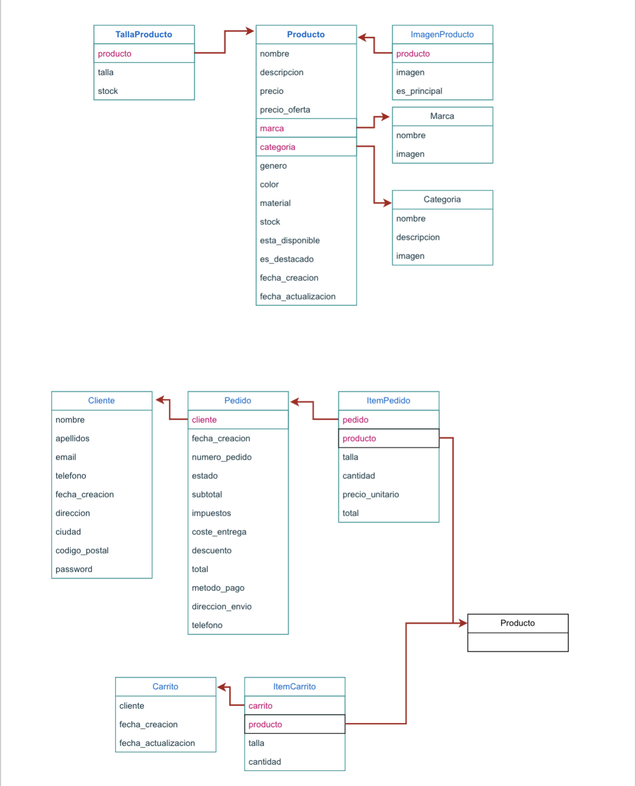
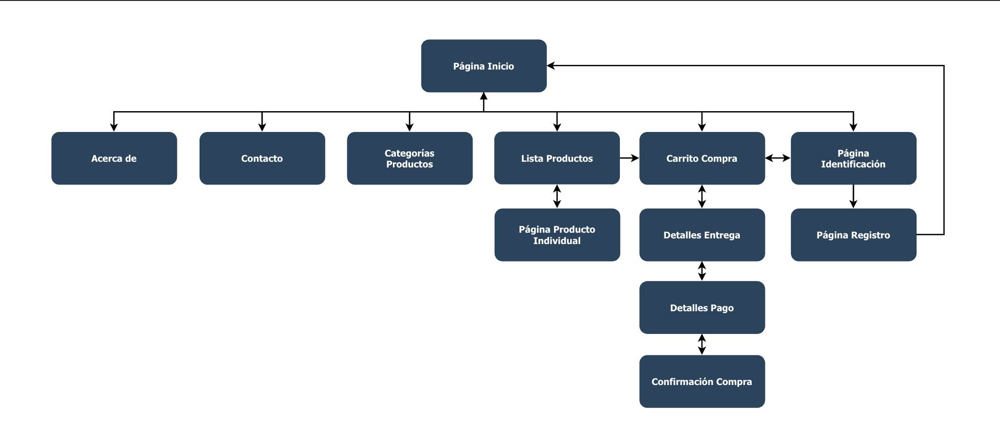

# EntertainPet

## Initial Build
https://ev.us.es/ultra/courses/_101203_1/outline/file/_5649317_1

## Deployment

````
$ python manage.py runserver
````

## DB
Cada vez que efectuemos cambios sobre los models sera necesario:
```
$ python manage.py makemigrations
$ python manage.py migrate 
$ python manage.py seed
```


## Stripe
Como no esta implementado la opcion de añadir un producto a un carrito desde la interfaz, lo haremos desde la ventana admin, para ello:

````
$ python manage.py createsuperuser
````

ve a /admin, introduce las credenciales del superuser y añadelos manualmente


numero de tarjeta de prueba: 4242424242424242
la fecha de caducidad tiene que ser posterior a la actual y el cvv cualquiera

## Tables



## Routes

